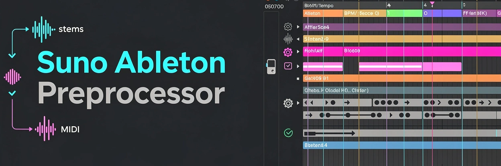

# suno-to-ableton




Turn your Suno AI songs into production-ready Ableton Live sessions. Export stems and MIDI from [suno.ai](https://suno.ai), run one command, and open a fully laid-out `.als` file — every track named, grid-aligned, tempo-matched, and ready to remix.

> **[Read the full documentation](https://steven-ahfu.github.io/suno-to-ableton/)**

## What it does

Automates all the tedious work between exporting from Suno and actually producing in Ableton:

- **Stem cleanup** — renames, normalizes, trims silence, and routes each stem to the correct track
- **Tempo and grid alignment** — detects BPM, aligns the first downbeat, and snaps everything to the grid
- **MIDI cleanup** — strips junk notes, fixes quantization, and sets the correct tempo
- **Arrangement detection** — identifies song sections like intro, verse, chorus, and bridge
- **Stem comparison** — evaluates stem quality and picks the cleanest version when alternatives exist
- **Key and harmony correction** — detects the key and fixes wrong notes in MIDI
- **`.als` export** — generates an Ableton Live Set ready to open and produce

## Quick start

### Prerequisites

- **Python 3.11+** — [install guide](docs/install.md#step-1-install-python-311)
- **ffmpeg** on PATH — [install guide](docs/install.md#step-2-install-ffmpeg)
- **pip** (bundled with Python) — [install guide](docs/install.md#step-3-install-pip)
- **PyTorch** (only for stem separation) — [install guide](docs/install.md#stem-separation-cpu)

> See **[Install](docs/install.md)** for full platform-specific installation instructions, optional extras, and dependency details.

### Install

```bash
git clone https://github.com/steven-ahfu/suno-to-ableton.git
cd suno-to-ableton
python3 -m venv .venv && source .venv/bin/activate
pip install -e .
```

For the TUI, stem separation, or GPU acceleration, see **[Install — Optional extras](docs/install.md#optional-extras)**.

### Export from Suno

1. Open your song on [suno.ai](https://suno.ai)
2. Download **Stems** (ZIP of numbered WAV files)
3. Optionally download the **MIDI** file
4. Unzip into a project directory:

```bash
mkdir ~/suno-exports/my-song
# Unzip stems ZIP and move .mid file here
```

Expected layout:
```
my-song/
├── 0 Song Name.wav       # Full mix
├── 1 FX.wav              # FX stem
├── 2 Synth.wav           # Synth stem
├── 3 Percussion.wav      # Percussion
├── 4 Bass.wav            # Bass
├── 5 Drums.wav           # Drums
├── 6 Backing_Vocals.wav  # Backing vocals
├── 7 Vocals.wav          # Vocals
├── 8 sample.wav          # Sample
└── Song Name.mid         # MIDI (optional)
```

> See **[Exporting from Suno](docs/suno-export.md)** for details on what Suno exports and how to handle edge cases.

### Process

```bash
# Read-only analysis
suno-to-ableton analyze ~/suno-exports/my-song

# Full processing pipeline
suno-to-ableton process ~/suno-exports/my-song

# Process + generate Ableton Live Set
suno-to-ableton process ~/suno-exports/my-song --export-als
```

> See **[CLI Usage](docs/usage-cli.md)** for the complete CLI reference, all flags, workflow examples, and advanced feature usage.

## Documentation

| Doc | Contents |
|-----|----------|
| **[Installation](docs/install.md)** | Prerequisites, platform-specific install commands, optional extras, dependency reference |
| **[Exporting from Suno](docs/suno-export.md)** | How to get your stems and MIDI out of Suno |
| **Usage** | |
| &nbsp;&nbsp;[CLI](docs/usage-cli.md) | CLI commands and workflow |
| &nbsp;&nbsp;[TUI](docs/usage-tui.md) | Interactive terminal interface |
| &nbsp;&nbsp;[CLI Flags Reference](docs/cli-flags.md) | Complete flag reference |
| &nbsp;&nbsp;[ALS Export](docs/als-export.md) | Ableton Live Set generation |
| &nbsp;&nbsp;[Workflow Examples](docs/workflows.md) | Common recipes for different use cases |
| &nbsp;&nbsp;[Reports & Output](docs/reports.md) | Report formats and output files |
| **Advanced Features** | |
| &nbsp;&nbsp;[Overview](docs/features/index.md) | Feature summary and the `--apply` flag |
| &nbsp;&nbsp;[Stem Quality Judgment](docs/features/stem-quality-judgment.md) | How stem comparison works, when to use `--choose-stems` |
| &nbsp;&nbsp;[Grid Anchor (Bar-1 Detection)](docs/features/grid-anchor.md) | Bar-1 detection for ambiguous intros |
| &nbsp;&nbsp;[Section Detection](docs/features/section-detection.md) | Arrangement section identification |
| &nbsp;&nbsp;[Harmonic MIDI Repair](docs/features/harmonic-midi-repair.md) | Key detection, wrong-note flagging, chord repair |
| &nbsp;&nbsp;[MIDI Requantization](docs/features/requantization.md) | Groove-aware quantization modes |
| &nbsp;&nbsp;[Separation Strategy](docs/features/separation-strategy.md) | Demucs vs UVR, targeted re-separation |
| **[Contributing](docs/contributing.md)** | Dev setup, project structure, code style, PR process |

## Contributing

See **[Contributing](docs/contributing.md)** for development setup, project structure, and how to submit changes.

## Acknowledgments

- [ableton-lom-skill](https://github.com/mikecfisher/ableton-lom-skill) — Ableton Live Object Model API reference used for Remote Script and ALS integration development

## License

See [LICENSE](LICENSE).
