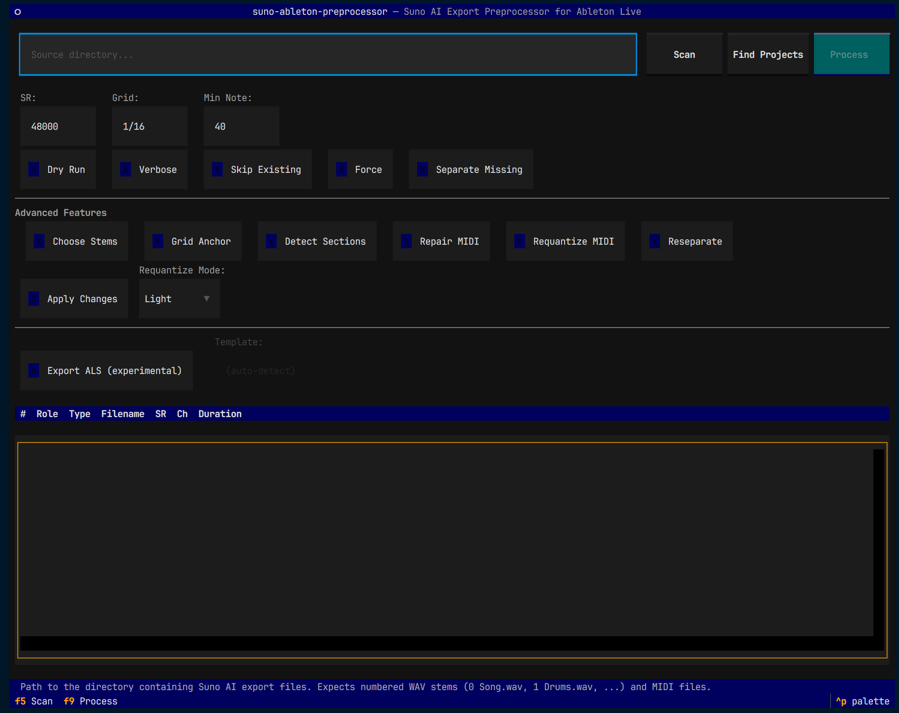

# suno-ableton-preprocessor

Suno AI export preprocessor for Ableton Live. Takes Suno's numbered WAV stems and MIDI export and produces grid-aligned, normalized files ready for an Ableton Live session.

## What it does

### Automatic (runs by default)

1. **Discovery** — finds and identifies numbered WAV stems and MIDI files
2. **Naming** — maps Suno's numbered filenames to stem roles (Drums, Bass, Vocals, etc.)
3. **Sample-rate conversion** — resamples all audio to 48kHz stereo WAV
4. **Silence trim** — removes leading silence so clips start cleanly
5. **BPM estimation** — beat-tracks the drums/percussion stem with librosa
6. **Global offset alignment** — computes downbeat offset so every clip lands on the Ableton grid
7. **Conservative MIDI cleanup** — removes empty tracks, short/duplicate notes, quantizes to grid, sets tempo
8. **Manifest + reports** — writes `manifest.json`, `bpm_report.json`, and `timing_report.json`

### Advanced (opt-in, only when you need it)

These require explicit flags — they never run unless you ask for them. Each has a detailed doc explaining what decisions it makes and when to use it.

- **[Stem quality judgment](docs/stem-quality-judgment.md)** (`--choose-stems`) — compares original vs AI-generated stems and recommends the better version
- **[Grid anchor / bar-1 detection](docs/grid-anchor.md)** (`--choose-grid-anchor`) — analyzes grid anchor candidates when the intro downbeat is unclear
- **[Section detection](docs/section-detection.md)** (`--detect-sections`) — identifies arrangement sections (intro, verse, chorus, etc.)
- **[Harmonic MIDI repair](docs/harmonic-midi-repair.md)** (`--repair-midi`) — detects key, flags out-of-key notes, fixes stacked chords
- **[MIDI requantization](docs/requantization.md)** (`--requantize-midi`) — re-snaps notes to grid while preserving feel
- **[Separation strategy](docs/separation-strategy.md)** (`--reseparate`, `--separate-missing`) — AI stem separation with Demucs or UVR
- **ALS export (experimental)** (`--export-als`) — generates an Ableton Live Set with stems placed on matching tracks

## Prerequisites

- **Python 3.11+**
- **ffmpeg** on PATH (for audio processing)
- **pip** (or any Python package manager)
- **PyTorch** (required for stem separation — install separately before the separation extras)

## Install

```bash
# Clone the repo
git clone https://github.com/your-org/suno-ableton-preprocessor.git
cd suno-ableton-preprocessor

# Base install (no GPU required)
pip install -e .

# With TUI (interactive terminal interface)
pip install -e '.[tui]'

# With stem separation (CPU-only)
pip install torch torchaudio --index-url https://download.pytorch.org/whl/cpu
pip install -e '.[separation]'

# With stem separation (CUDA GPU acceleration — recommended if you have an NVIDIA GPU)
pip install torch torchaudio --index-url https://download.pytorch.org/whl/cu121
pip install -e '.[separation-gpu]'

# Everything (CPU)
pip install -e '.[tui,separation]'
```

> **Note:** PyTorch must be installed before the separation extras. Demucs uses PyTorch for inference and will run on CPU by default, but CUDA acceleration significantly speeds up stem separation. Visit [pytorch.org](https://pytorch.org/get-started/locally/) to find the right install command for your platform and CUDA version.

## Exporting from Suno

Before using this tool, you need to export your song from Suno with stems and MIDI.

### How to export

1. Open your song on [suno.com](https://suno.com)
2. Click the **download** button and select **Stems** — this downloads a ZIP containing individually numbered WAV files for each instrument
3. If available, download the **MIDI** file for the same song (Suno Studio can export MIDI derived from stems — useful for recreating melodies or drum patterns with your own instruments)
4. Create a project directory and unzip/move all files into it:

```bash
mkdir ~/suno-exports/my-song
# Unzip the stems ZIP into this directory
# Move the .mid file into the same directory (if available)
```

### What Suno exports

Suno exports **tempo-locked WAV stems** — all stems share the same BPM, sample rate, and frame count. This means:

- Stems stay aligned to the song's BPM when imported into a DAW
- They line up on the grid without manual adjustment
- Minimal warping is required in Ableton

The preprocessor verifies this: it checks that all stems have consistent sample rates and frame counts, and warns if anything is off.

**MIDI is optional.** Not every Suno export includes MIDI. When available, it's a transcription (not the original sequence), so it may contain wrong notes or phantom chords — the preprocessor's [harmonic MIDI repair](docs/harmonic-midi-repair.md) feature can help clean these up.

### Expected project directory structure

```
my-song/
├── 0 Song Name.wav          # Full mix (track 0)
├── 1 FX.wav                 # FX stem
├── 2 Synth.wav              # Synth stem
├── 3 Percussion.wav         # Percussion stem
├── 4 Bass.wav               # Bass stem
├── 5 Drums.wav              # Drums stem
├── 6 Backing_Vocals.wav     # Backing vocals stem
├── 7 Vocals.wav             # Vocals stem
├── 8 sample.wav             # Sample stem
└── Song Name.mid            # MIDI file (optional)
```

**Notes:**
- WAV files are numbered `0`–`8` and prefixed with the stem type
- Track 0 is always the full mix; tracks 1–8 are the individual stems
- The MIDI file has no number prefix — it matches the song name
- All WAVs should be 48kHz stereo float with identical frame counts (tempo-locked)
- Not all stems may be present in every export (e.g. some songs have no sample or FX stem) — the preprocessor handles missing stems gracefully

## Usage — CLI

The command-line tool is called `suno-ableton-preprocessor`.

### Quick analysis (read-only)

Scan a project directory and print BPM, alignment, and inventory info without writing any files:

```bash
suno-ableton-preprocessor analyze /path/to/my-song
```

### Full processing pipeline

Process audio and MIDI, write normalized stems and cleaned MIDI to a `processed/` subdirectory:

```bash
suno-ableton-preprocessor process /path/to/my-song
```

Output structure:
```
my-song/
└── processed/
    ├── stems/          # Normalized, trimmed WAVs
    ├── midi/           # Cleaned MIDI files
    └── reports/        # manifest.json, bpm_report.json, timing_report.json
```

### Process and export an Ableton Live Set

```bash
suno-ableton-preprocessor process /path/to/my-song --export-als
```

This adds a `Song.als` file to `processed/` that you can open directly in Ableton Live, with stems placed on pre-configured tracks.

### Process with all options

```bash
suno-ableton-preprocessor process /path/to/my-song \
  --export-als \
  --detect-sections \
  --choose-grid-anchor \
  --repair-midi \
  --requantize-midi --requantize-mode light \
  --apply
```

### Standalone commands

```bash
# Stem separation only
suno-ableton-preprocessor separate /path/to/my-song --separator demucs

# View existing manifest
suno-ableton-preprocessor report /path/to/my-song

# Generate Ableton Live Set from already-processed output
suno-ableton-preprocessor export-als /path/to/my-song

# Advanced features (standalone, only if needed)
suno-ableton-preprocessor choose-stems /path/to/my-song --apply
suno-ableton-preprocessor choose-grid-anchor /path/to/my-song
suno-ableton-preprocessor detect-sections /path/to/my-song
suno-ableton-preprocessor repair-midi /path/to/my-song --apply
suno-ableton-preprocessor requantize-midi /path/to/my-song --mode swing --apply
suno-ableton-preprocessor reseparate /path/to/my-song --target full_mix
```

## Usage — TUI (interactive terminal interface)

Requires the `tui` extra: `pip install -e '.[tui]'`

```bash
suno-ableton-preprocessor tui
```

<p align="center">
  
</p>

This launches a point-and-click terminal interface where you can:
- Browse and select project directories
- Toggle processing options with checkboxes
- Run the pipeline and view results in real time

## CLI flags

### Pipeline tuning

These adjust the automatic pipeline. You usually don't need to change them.

| Flag | Default | Description |
|------|---------|-------------|
| `--output-dir`, `-o` | `processed` | Output directory |
| `--dry-run` | off | Show what would be done without writing files |
| `--verbose`, `-v` | off | Verbose output |
| `--skip-existing` | off | Skip already-processed files |
| `--force` | off | Overwrite existing files |
| `--target-sr` | 48000 | Target sample rate |
| `--quantize-grid` | 1/16 | MIDI quantization grid |
| `--min-note-ms` | 40 | Minimum MIDI note duration in ms |
| `--separate-missing` | off | Run stem separation on full mix |
| `--separator` | demucs | Separation backend: `demucs` or `uvr` |

### Advanced features (opt-in)

None of these run unless you explicitly pass the flag. Use them when the automatic results need manual correction or deeper analysis.

| Flag | Description |
|------|-------------|
| `--choose-stems` | Stem quality replacement — compare original vs AI-generated stems |
| `--choose-grid-anchor` | Ambiguous bar-1 correction — analyze grid anchor candidates |
| `--detect-sections` | Section detection — identify intro, verse, chorus, etc. |
| `--repair-midi` | Harmonic MIDI repair — detect key, fix out-of-key notes and stacked chords |
| `--requantize-midi` | Groove-sensitive requantization — re-snap notes while preserving feel |
| `--requantize-mode` | Requantize mode: `strict`, `light`, `swing`, `triplet` |
| `--reseparate` | Targeted reseparation — re-run AI stem separation |
| `--apply` | Write advanced feature changes to output files (without this, features only print analysis) |

### Export

| Flag | Description |
|------|-------------|
| `--export-als` | Generate Ableton Live Set from processed output |
| `--als-template` | Path to `Example.als` template (auto-detected if not set) |

## ALS export

The `--export-als` flag generates an Ableton Live Set by:

1. Copying the `Example.als` template (bundled or specify with `--als-template`)
2. Setting project tempo to detected BPM
3. Matching processed stems to template tracks by type (Drums, Bass, Vocals, etc.)
4. Injecting unwarped AudioClips into arrangement view
5. Muting the full mix reference track

The template has pre-configured tracks: Drums, Percussion, Bass, Synth, Vocals, Backing Vocals, FX, Sample, plus MIDI tracks.

## Dependencies

- **librosa** — BPM detection, onset analysis, section detection
- **pretty_midi** — MIDI reading/writing/cleanup
- **soundfile** — Audio metadata probing
- **scipy** — Signal processing for feature analysis
- **ffmpeg** — Audio normalization and format conversion (external)
- **rich** — Terminal output formatting
- **typer** — CLI framework
- **pydantic** — Data models and serialization
- **textual** — TUI (optional, install with `.[tui]`)
- **demucs** / **audio-separator** — Stem separation (optional, install with `.[separation]`)

## Acknowledgments

- [ableton-lom-skill](https://github.com/mikecfisher/ableton-lom-skill) — Ableton Live Object Model API reference used for Remote Script and ALS integration development

## License

See [LICENSE](LICENSE).
